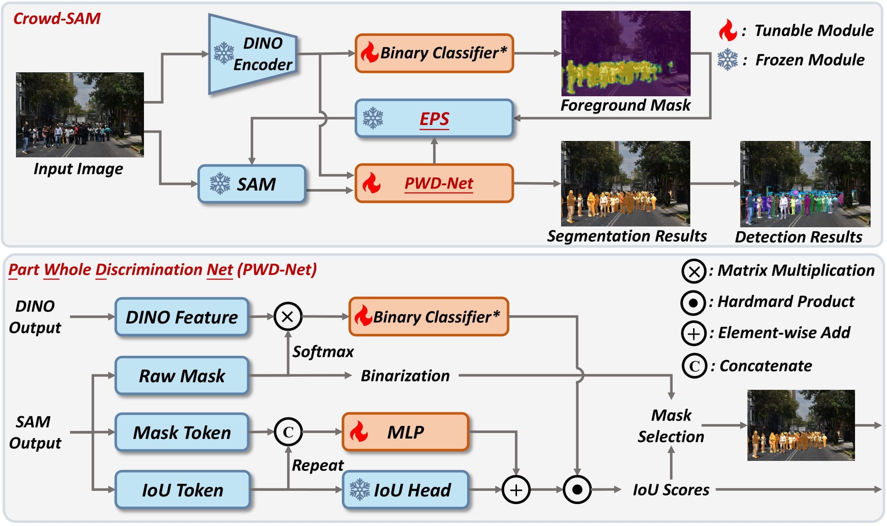
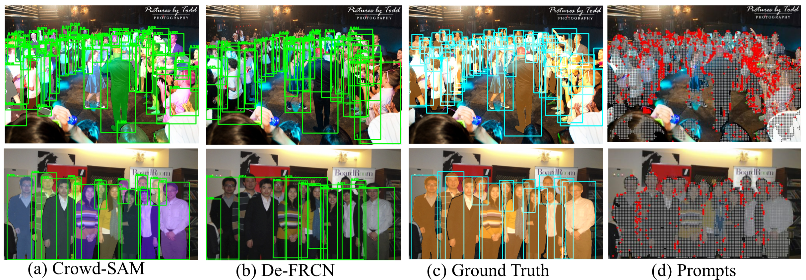
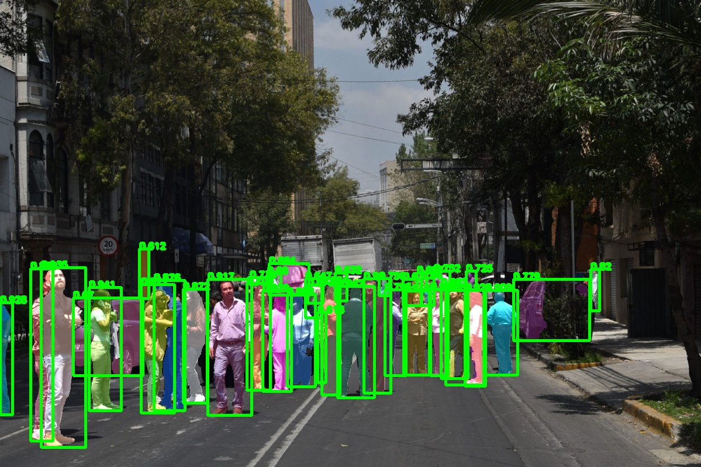

# Crowd-SAM: SAM as a Smart Annotator for Object Detection in Crowded Scenes
<p align="center">
    
</p>

#### [Zhi Cai](https://github.com/FelixCaae)<sup>1,2</sup>, Yingjie Gao<sup>1,2</sup>, [Yaoyan Zheng](https://github.com/BUAAHugeGun)<sup>1,2</sup>, Nan Zhou<sup>1,2</sup> and [Di Huang](https://irip.buaa.edu.cn/dihuang/index.html)<sup>1,2</sup>


#### **<sup>1</sup>SCSE Beihang University, <sup>2</sup>IRIP Lab Beihang University**


[](https://arxiv.org/abs/2407.11464)

---

## 📢 Latest Updates
- **Aug-1-24**: We open source the code, models.🔥🔥
- **Jul-20-24**: Crowd-SAM paper is released [arxiv link](https://arxiv.org/abs/2407.11464). 🔥🔥
- **Jul-1-24**: Crowd-SAM has been accepted to **ECCV-24** 🎉. 
---


##  Overview
Crowd-SAM is a novel few-shot object detection and segmentation method designed to handle crowded scenes.  Generally, object detection requires extensive labels for
 training, which is quite time-consuming, especially in crowded scenes. In this work, We combine SAM with the specifically designed efficient prompt  sampler and a mask selection PWD-Net to achieve fast and accurate pedestrian detection! Crowd-SAM achieves 78.4\% AP on the Crowd-Human benchmark with 10 supporting images which is comparable to supervised detectors. 



##  Installation
We recommend to use virtual enviroment, *e.g. Conda*,  for installation:
1. Create virtual environment:
   ```bash
   conda create -n crowdsam python=3.8
   ```

2. Clone this repository:
   ```bash
   git clone https://github.com/yourusername/crowd-sam.git
   cd crowdsam
   pip install -r requirements.txt
   git submodule update --init --recursive
   pip install .
   ```
3. Download 
    DINOv2(Vit-L) [checkpoint](https://dl.fbaipublicfiles.com/dinov2/dinov2_vitl14/dinov2_vitl14_pretrain.pth)
    SAM(ViT-L) [checkpoint](https://dl.fbaipublicfiles.com/segment_anything/sam_vit_l_0b3195.pth).
     
    Place the donwdloaded weights in the  *weights* directory. If it does not exist, use command ``` mkdir weights ``` to create one.
   
## Data Preparation
### 1. CrowdHuman

Download the CrowdHuman dataset from the [official website](https://www.crowdhuman.org/download.html). *Note that we only need the CrowdHuman_val.zip* and *annotation_val.odgt*. For training data, we have prepared it in the crowdhuman_train directory and please copy the files into ./dataset/crowdhuman before training.
Extract and place the downdloaded zip files in the `dataset` directory and it should look like this:

```
crowdsam/
├── dataset/
│   └── crowdhuman/
│       ├── annotation_val.odgt
│       ├── Images
└── ...
```

Run the script to convert odgt file to json file.
```
python tools/crowdhuman2coco.py -o annotation_val.odgt -v -s val_visible.json -d dataset/crowdhuman
```
##  How to use
1.  To start training the model, run the following command:
```bash
python train.py --config_file ./configs/config.yaml
```
Our model configs are written with yaml in the *configs* directory. Make sure to update the `config.yaml` file with the appropriate paths and parameters as needed.

We prepare a pretrained adapter weights for CrowdHuman [here](https://drive.google.com/file/d/18034Wbd_Q01W0eBxlOuh4VzuOIob_eqy/view?usp=sharing) 

2. To evaluate the model, we recommend to use the following command for batch evaluation:
```bash
python tools/batch_eval.py --config_file ./configs/config.yaml -n num_gpus
```

3. To visualize the outputs, use the following command:
```bash
python tools/test.py --config_file ./configs/config.yaml --visualize
```

4. To run demo on your images, use the following command:
```bash
python tools/demo.py --config_file ./configs/config.yaml --input target_directory
```


This will run the evaluation script on the test dataset and output the results.
##  📊 Qualitative Results

<!--  -->

## Acknowlegement
We build our project based on the segment-anything and dinov2.

## 📜 Citation
You can cite our paper with such bibtex:
```bibtex
@inproceedings{cai2024crowd,
  title={Crowd-SAM: SAM as a Smart Annotator for Object Detection in Crowded Scenes},
  author={Cai, Zhi and Gao, Yingjie and Zheng, Yaoyan and Zhou, Nan and Huang, Di},
  booktitle={Proceedings of the European Conference on Computer Vision (ECCV)},
  year={2024}
}
```
